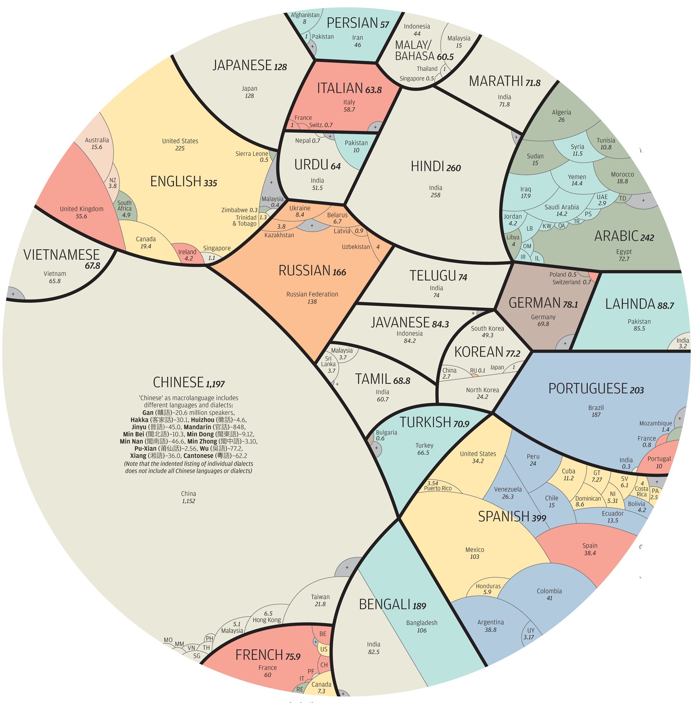
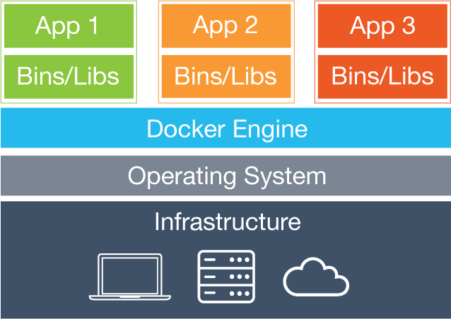
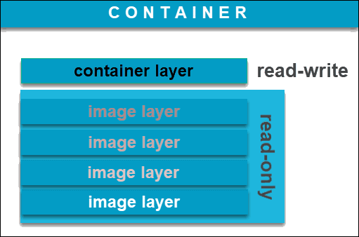

<style>
footer {
    font-size: 30px;
}
footer img {
    width: 300px;
    margin-bottom: -20px;
    margin-left: -29px;
    margin-right: 45px;
    float: left;
}
section.lead h1 {
  text-align: top;
  margin-left: 40px;
  margin-bottom: 450px;
}
header {
    width: 350px;
    margin-left:-35px;
    text-align: right;
    font-size: 30px
}
header img {
    width: 150px;
    margin-right: 175px;
}
</style>


<!-- _footer: "


" -->

# Software Containerization with Docker
## Jimmy Liu <br> Feb 14th 2023

---


# The world is a diverse place

<!-- _footer: "Credit: " -->

---
<!-- _header: "Credit: Wikipedia" -->
<!-- _class: lead -->
# A rapidly evolving space

<br>


---
<!-- _footer: "Trisovic. Sci Data. (2022)" -->


---
# Challenge
> ## Sharing and deploying reproducible code in dynamic and diverse environments

---
# Solution
> ## A host-independent format to package and deploy software components

---
<!-- _header: "Credit: Google Images" -->


---
<!-- _footer: "The Conversation (2021)" -->


---
# Docker Architecture
<!-- _header: "" -->

- Can virtualize multiple OS on any host infrastructure
- Source code, libraries, dependencies are packaged in immutable objects called `images`
- Mutable running instances of `images` are called `containers`

---
# A container is simply another layer on top

- New images are built by adding layers to existing images
- Each layer encodes tracked changes

---
# Demo: Writing a Dockerfile
| Directive | Description | Example |
| --- | --- | --- |
| `FROM` | Base image | ```FROM python:3.9.16 ``` |
| `RUN` | Command(s) to execute | ```RUN pip install pandas``` |
| `ARG` | Define variables within Dockerfile | ```ARG script="./src/parse.py"``` |
| `ADD` | Import files from the host system | ```ADD $script /src/``` |
| `ENV` | Define environment variables accessible <br> within containers | ```ENV BLAST_DB="/data/ncbi.db"``` |

---
# Demo: Writing a Dockerfile (10 minutes)
#### 1. Build a custom image using `biocontainers/blast:2.2.31` as base image
#### 2. Add the query sequence to the image under `/data`
#### 3. Add the BLAST database to the image under `/blast_db`

---
# Demo: Building the Docker image
<br>

**Command structure**
```
docker build -t [image_name]:[image_tag] [Path to Dockerfile]
```
**Example command**
```bash
docker build -t blast .
```

---
# Demo: Running BLAST in Docker containers

**Command structure**
```bash
docker run [image_name] [cmd]
```

**Example command**
```bash
docker run blast blastn \
    -db /blast_db/plasmids \
    -query /data/query.fasta \
    -out blast.out \
    -outfmt 6 \
    -word_size 7 \
    -evalue 1e-5
```

---
# Demo: Pushing Docker image to Container Registry
**Log into DockerHub**
- Username: `cidgoh`
- Password: See [spreadsheet](https://docs.google.com/spreadsheets/d/1hq338hAnt2cPVuSf3ZfvfGZxXbsyYJYZPxOrrtF6X8M/edit?usp=sharing_eip_m&ts=63e2b61d)
```bash
docker login -u [username] -p [password]
```

**Tag image**
```
docker tag blast cidgoh/blast:[username]
```

**Push image to DockerHub**
```
docker push cidgoh/blast:[username]
```

---
# Advanced Topics
* ## Automated builds with CI/CD
* ## Persistent volumes
* ## Multi-stage builds
* ## Multi-container applications (`docker-compose`)